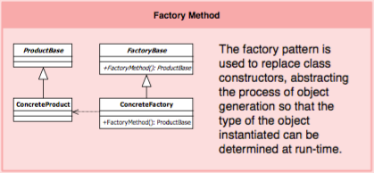
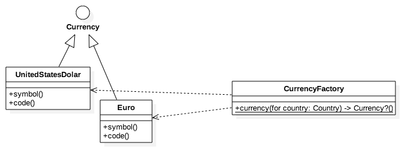

# Factory Method Design Pattern, in Swift 3.0

Inspired on [github ochococo/Design-Patterns-In-Swift](https://github.com/ochococo/Design-Patterns-In-Swift)

## Definition

The factory pattern is used to replace class constructors, abstracting the process of object generation so that the type of the object instantiated can be determined at run-time.

## Pattern Diagram

## Class Diagram for [Currency Factory example (@ochococo)](https://github.com/ochococo/Design-Patterns-In-Swift#-factory-method)

## Implementation Details

I implemented a second example, the one present in [Design Patterns book by Head First](http://shop.oreilly.com/product/9780596007126.do). An implementation in Java can be found in [adagio/PizzaStores - factory method branch](https://github.com/adagio/PizzaStores/tree/factorymethod)

There is a slight difference, between this two examples. The one from Head First considers Creator and Concrete Creator classes. We have implemented NYStylePizzaStore, but not a PizzaStore protocol.

## Another implementations

- [Factory Method, by 5Neo.Be](http://www.5neo.be/design-patterns-in-swift-factory-method-creational/). AppleProductCreator, iPhoneProductCreator, AppleProduct, iPadProduct...
- [Factory Method, by zsergey st github](https://github.com/zsergey/Design-Patterns-In-Swift#creational). Developer Factory, SwiftDeveloperFactory, ObjCDeveloperFactory, Languages...
- [The Factory Method Pattern, by Jeremy Kaczmarczyk](https://medium.com/jeremy-codes/factory-method-in-swift-d5222dd6e61d). GameCreator, Game, Basketball1on1, StreetBasketball2on2...
